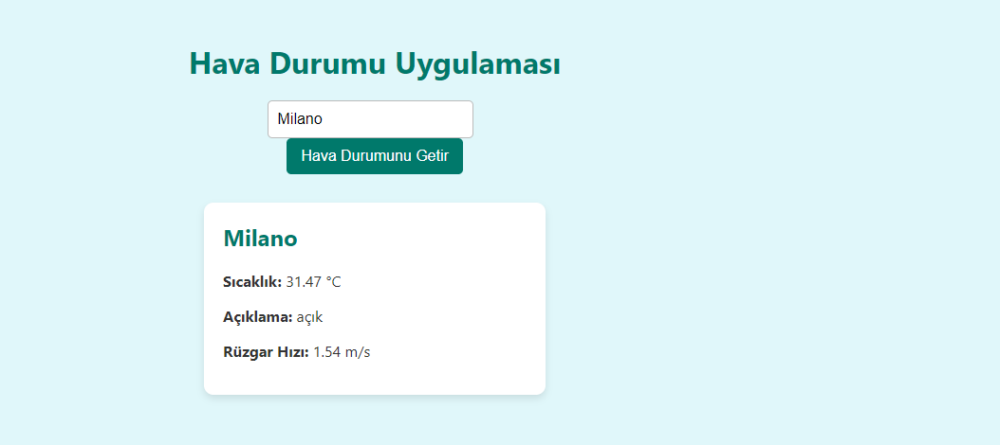

# 🌤️ Weather API Application

> 🇹🇷 A modern weather application built with Node.js and Express that fetches current weather data from OpenWeatherMap API with Turkish language support

## 📸 Screenshots

### 🏙️ Desktop Interface - Different Cities

<div align="center">

| 🇹🇷 Ankara | 🇺🇸 New York | 🇮🇹 Milano |
|:---:|:---:|:---:|
|  |  |  |

</div>

## ✨ Features

- 🌍 **Real-time weather data** for any city worldwide
- 🎨 **Clean and responsive** web interface
- 🌡️ **Comprehensive weather info** including temperature, description, and wind speed
- 🇹🇷 **Turkish language support** with localized interface
- 🔄 **CORS enabled** for cross-origin requests
- ⚡ **Fast and lightweight** architecture
- 📱 **Mobile-friendly** responsive design
- 🛡️ **Secure API key handling** with environment variables

## 🛠️ Technologies Used

| Category | Technology | Description |
|----------|------------|-------------|
| **Backend** | 🟢 Node.js | JavaScript runtime environment |
| **Framework** | 🚀 Express.js | Fast, unopinionated web framework |
| **HTTP Client** | 📡 Axios | Promise-based HTTP client |
| **Frontend** | 🌐 HTML5 + CSS3 + JS | Modern web technologies |
| **API** | 🌤️ OpenWeatherMap | Weather data provider |
| **Environment** | 🔧 dotenv | Environment variables management |
| **CORS** | 🔄 cors | Cross-Origin Resource Sharing |

## 📋 Prerequisites

Before running this application, make sure you have:

- 🟢 **Node.js** (version 18 or higher)
- 📦 **npm** (Node Package Manager)
- 🔑 **OpenWeatherMap API key** (free)

## 🚀 Installation

### 1. 📥 Clone the repository
```bash
git clone https://github.com/harun-trkylmzgl/weather-api.git
cd weather-api
```

### 2. 📦 Install dependencies
```bash
npm install
```

### 3. 🔧 Set up environment variables
Create a `.env` file in the root directory and add your OpenWeatherMap API key:
```env
WEATHER_API_KEY=your_openweathermap_api_key_here
```

🔑 **Get your free API key:** Visit [OpenWeatherMap](https://openweathermap.org/api) and create a free account.

## 🎯 Usage

### 1. 🖥️ Start the server
```bash
npm start
# or
node index.js
```

### 2. 🌐 Access the application
Open your browser and navigate to `http://localhost:3000`

### 3. 🔌 Using the API directly
```bash
# Example API call
curl "http://localhost:3000/weather?city=Istanbul"
```

## 📡 API Endpoints

### GET /weather
Fetches weather data for a specified city.

📝 **Parameters:**
- `city` (required): Name of the city

📨 **Example Request:**
```http
GET /weather?city=Istanbul
```

📤 **Example Response:**
```json
{
  "şehir": "Istanbul",
  "sıcaklık": "22°C",
  "açıklama": "açık hava",
  "rüzgar": "2.5 m/s"
}
```

❌ **Error Response:**
```json
{
  "error": "Şehir bulunamadı. Şehir adını kontrol edin."
}
```

## 📦 Dependencies

| Package | Version | Description |
|---------|---------|-------------|
| express | ^5.1.0 | 🚀 Fast web framework for Node.js |
| axios | ^1.11.0 | 📡 Promise-based HTTP client |
| cors | ^2.8.5 | 🔄 Enable CORS for cross-origin requests |
| dotenv | ^17.2.1 | 🔧 Load environment variables from .env file |

## ⚙️ Configuration

The application uses the following configuration:

- 🌐 **Port:** 3000 (default, configurable via PORT env variable)
- 📡 **API Base URL:** https://api.openweathermap.org/data/2.5/weather
- 📏 **Units:** Metric (Celsius)
- 🗣️ **Language:** Turkish (tr)

## 🛡️ Error Handling

The application includes comprehensive error handling:

- ❌ Missing city parameter → 400 status code
- 🚨 API errors → 500 status code + error details
- 👤 User-friendly error messages on frontend
- 🔍 City not found → 404 status code
- 🔑 Invalid API key → 401 status code

## 🔐 Security Notes

- ⚠️ Never commit your `.env` file - contains API keys
- 🔑 API key is loaded from environment variables
- 🔄 CORS is enabled for development (configure for production)
- 🛡️ Input validation and error handling implemented

## 🚀 Deployment

### Heroku
```bash
# Create Heroku app
heroku create your-weather-app

# Set environment variables
heroku config:set WEATHER_API_KEY=your_api_key_here

# Deploy
git push heroku main
```

### Vercel
```bash
# Install Vercel CLI
npm i -g vercel

# Deploy
vercel

# Set environment variables in Vercel dashboard
```

### Railway
```bash
# Install Railway CLI
npm install -g @railway/cli

# Login and deploy
railway login
railway init
railway up
```

## 🤝 Contributing

Contributions are welcome! Please feel free to submit a Pull Request.

1. 🍴 Fork the repository
2. 🌿 Create a feature branch (`git checkout -b feature/amazing-feature`)
3. 💾 Commit your changes (`git commit -m 'Add amazing feature'`)
4. 📤 Push to the branch (`git push origin feature/amazing-feature`)
5. 🔄 Open a Pull Request

## 📄 License

This project is open source and available under the [MIT License](LICENSE).

## 🆘 Support

If you encounter any issues or have questions:

- 🐛 [Open an issue](https://github.com/harun-trkylmzgl/weather-api/issues)
- 📧 Email: harunturkyilmazoglu@gmail.com
- 💬 Create a discussion for general questions

## 🙏 Acknowledgments

- 🌤️ [OpenWeatherMap](https://openweathermap.org/) - For providing the weather API
- 🚀 [Express.js](https://expressjs.com/) - For the amazing web framework
- 📡 [Axios](https://axios-http.com/) - For HTTP requests
- 🎨 Modern CSS - For responsive design

## 🌟 Show your support

Give a ⭐ if this project helped you!

---

**👨‍💻 Developed with ❤️ by Harun Türkyılmazoğlu**  
📧 Contact: harunturkyilmazoglu@gmail.com